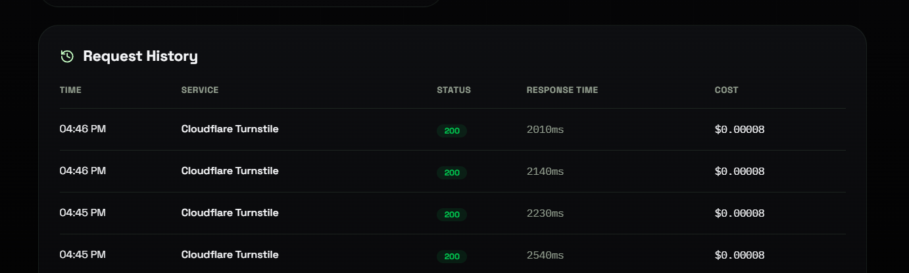

# Cloudflare Challenge Solver (Turnstile & IUAM)

[](https://xsolve.me)
[](https://docs.xsolve.me/)

A high-performance, ultra-fast API solver for **Cloudflare Turnstile** and **Cloudflare IUAM (Under Attack Mode)** challenges. Designed for seamless, automated web scraping, data extraction, and bot automation.

---

## 📊 Screenshot



---

## 🔗 Links
* **Website:** [https://xsolve.me](https://xsolve.me)
* **Documentation:** [https://docs.xsolve.me/](https://docs.xsolve.me/)

---

## ✨ Features
* 🚀 **High Speed:** Solves under **1-4s**
* 🛡️ **Advanced Bypass:** Bypasses Turnstile (`task.turnstile`) and IUAM (`task.iuam`) defense layers.
* 💳 **Pay-Per-Solve:** 100% success-only billing policy.
* 🔌 **Simple Integration:** Integrate easily using HTTP requests in Python, JavaScript, Curl, Go, PHP, etc.

---

## 💰 Pricing & Available Tasks

We offer high-performance solvers at competitive prices:

| Available Task | Task Identifier | Price (per 1k requests) |
| :--- | :--- | :--- |
| **Cloudflare Turnstile** | `task.turnstile` | **$0.08** |
| **Cloudflare IUAM** *(Currently down)* | `task.iuam` | **$0.08** |

* ⚡ **Cost:** **$0.00008** per one solve
* ✔️ **Only pay for successful solves**
* 🪙 **Payment Method:** **Cryptocurrency**

### 💳 Deposit Value Examples

That's over **12,500** CAPTCHAs solved for just a single dollar!

| Deposit Amount | Solves / Tokens |
| :--- | :--- |
| **$1** | 12,500 (12.5k) |
| **$5** | 62,500 (62.5k) |
| **$10** | 125,000 (125k) |
| **$20** | 250,000 (250k) |
| **$50** | 625,000 (625k) |
| **$100** | 1,250,000 (1.25m) |

## 🚀 Quick Integration (Python)

To integrate our solver into your application, use the following simple Python example:

```python
import requests

url = "https://api.xsolve.me/task"

headers = {
    "X-Api-Key": "YOUR_API_KEY",
    "Content-Type": "application/json"
}

payload = {
    "mode": "turnstile",
    "url": "https://example.com",  # Replace with the target site URL
    "sitekey": "0x4AAAAAA..."      # Replace with the target Turnstile sitekey
}

response = requests.post(url, headers=headers, json=payload)
print(response.json())
```

For full API documentation, other languages (Curl, JavaScript), and custom integrations, check our [Documentation](https://docs.xsolve.me/) or log in to your dashboard at [xsolve.me](https://xsolve.me).

---

## 💬 Community & Support
* **Telegram Channel:** [https://t.me/rex_update](https://t.me/rex_update)
* **Discord Server:** [https://discord.gg/eM6wqY7z53](https://discord.gg/eM6wqY7z53)
